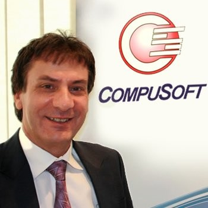

## 👥 Who We Are

<table style="border-collapse: collapse; border: none;">
  <tr>
    <td style="border: none; padding: 20px;" align="center" valign="top">
      <a href="https://www.linkedin.com/in/talbenxu/"> <strong>Pei Xu</strong> CoFounder & CEO</a> 
      Visionary in enterprise blockchain and smart contract security. Leads LeXurey’s product direction with expertise in ERP transformation and privacy-preserving compliance.
    </td>
    <td style="border: none; padding: 20px;" align="center" valign="top">
      <a href="https://www.linkedin.com/in/brandon-yang-yu/"> <strong>Yang Yu</strong> CoFounder & COO</a> 
      Responsible for solution delivery and systems engineering. Oversees cross-platform implementation and client satisfaction.
    </td>
  </tr>
  <tr>
    <td style="border: none; padding: 20px;" align="center" valign="top">
      <a href="https://www.linkedin.com/in/joecardinale/"> <strong>Joe Cardinale</strong> ERP Senior Advisor</a> 
      Decades of experience guiding ERP rollouts in complex industries. Advises LeXurey on architecture, delivery models, and industry partnerships.
    </td>
    <td style="border: none; padding: 20px;" align="center" valign="top">
      <a href="https://www.linkedin.com/in/yuekang-li-9a890b68/"> <strong>Dr. Yuekang Li</strong> Web3 Security Advisor</a> 
      Lecturer at UNSW and expert in formal verification and fuzz testing. Leads the research behind LeXurey's smart contract assurance pipeline.
    </td>
  </tr>
  <tr>
    <td style="border: none; padding: 20px;" align="center" valign="top">
      <a href="https://www.linkedin.com/in/jiahao-zhang-878a632b6/"> <strong>Jiahao Zhang</strong> Technical Consultant</a> 
      Supports cross-platform ERP development, Power Platform integration, and ESG-focused implementation across food and logistics clients.
    </td>
    <td style="border: none; padding: 20px;" align="center" valign="top">
      <a href="https://www.linkedin.com/in/ziqi-ding-38353a327/"> <strong>Ziqi Ding</strong> Security Researcher</a> 
      Focuses on source mapping and vulnerability detection in smart contracts. Builds the tooling for profit-centric fuzzing and compliance auditing.
    </td>
  </tr>
</table>

---

## 💼 What We’re Capable Of

### 1. ERP – The Cornerstone of Our Services

ERP implementation is at the heart of our operations. We deliver industry-standard solutions across a wide range of sectors, focusing on **cost-efficiency without compromising quality**. Our smart resource integration allows us to provide **premium results at accessible pricing**—contact us to learn how we do it.

We have deep experience in the **food distribution sector**, having worked with:
- Members of the **Countrywide Group**, one of Australia’s largest foodservice buying groups.
- Distributors for major retailers like **Coles**, **Woolworths**, and **IGA (Metcash)**.
- Connect local businesss with Leading dairy brands like **Saputo** and **Lactalis**.

Our integrations include:
- **Xero**, **Power BI**, **Tableau**
- **Tasklet scanner modules**, **iPad webstore systems**, and custom dashboards
- Specialized functions: pantry tracking, purchase/sales forecasting, cartage automation, and more

Through proper project management and extensive experience, we ensure **smooth transitions from legacy to leading-edge systems**—complete with capped pricing, automated test packages, and live UAT environments.

Our clients benefit from **future-ready innovations**, including dynamic carbon credit modules and free lifetime code updates (excluding installation & service fees).

---

### 2. ESG – Verified, Automated, and Trustworthy

LeXurey is developing **zero-knowledge proof (ZKP)** based tools that automatically verify ESG compliance—without revealing sensitive internal data.

Current ESG solutions vary greatly across institutions, leading to fragmented standards and unverifiable impact claims. Fraud and misreporting remain persistent risks.

Our solution combines **Web3 transparency with ZKP security**, enabling:
- Universal APIs to upload and cryptographically verify ESG data
- Instant proof validation — where **everyone becomes the auditor**
- Easy integration without the need for expensive system overhauls

We empower businesses to gain regulatory trust and sustainability benefits through **tamper-proof ESG reporting**.

---

## 🔭 Our Vision

We aim to build a world where **business trust, environmental integrity, and operational transparency** converge through blockchain-integrated ERP systems.

---

## 🧩 What We Do

- **ERP Implementation & Integration**
- **Carbon Credit Lifecycle Automation (ZKP-backed)**
- **ESG Compliance & Reporting Frameworks**
- **Smart Contract Auditing & Security Tools**
- **Open-Source Libraries & Universal Middleware**

---

## 🚀 What Makes LeXurey Capable

- **Research Depth**: Advanced expertise in ZKPs, fuzz testing, and smart contract analysis  
- **Delivery Experience**: ERP + Blockchain deployments for mission-critical workflows  
- **Security Focus**: Profit-driven vulnerability discovery and mitigation pipelines

---

## 🎯 Research Questions Driving Our Innovation

1. How can ZKPs integrate seamlessly into ERP systems?
2. What architecture ensures secure, real-time data flow between ERP and blockchain?
3. How can we optimize ZKP throughput while preserving privacy?
4. How can fuzzing detect high-impact bugs before production?
5. How do we enforce compliance under shifting ESG standards without revealing sensitive data?

---

## 🛠️ Our Solution

We are building a **Blockchain-Integrated ERP Extension** that:
- Issues verifiable carbon credits using ZKPs
- Publishes compliance proofs to blockchain securely
- Offers plug-and-play compatibility with Business Central and NetSuite
- Enables enterprise-grade ESG auditability

---

## 🔄 Action in Progress

- Implementation agreements finalized with 7 local food distributors (as of 06/06/2025)
- Circom/zkSolc-based smart contract construction
- ZKP-aware source mapping and fuzzing tools
- Middleware connector for ERP data integration
- Pilot implementations with SME partners
- ESG Toolkit (open-source) under development

---

## 🤝 Partnerships

- **Compusoft Australia** – [Gold Microsoft Partner](https://compusoftaus.com.au/), and one of Australia’s most established ERP solution providers.  
  LeXurey and Compusoft share a long-term strategic partnership, committed to delivering **fast, high-quality, and highly affordable** tailored ERP solutions across industries. Together, we combine deep technical capability with implementation agility to help your business scale with confidence.

---

## ⚠️ Challenges We Tackle

- ZKP complexity in enterprise environments
- Diverse ESG frameworks with inconsistent reporting logic
- Balancing transparency with data privacy
- Reinforcing public and institutional trust in carbon markets

---

## 📩 Contact Us

Pei Xu – Director  
📧 admin@lexurey.com  
🌐 [https://lexurey.com](https://lexurey.com)  
🔗 GitHub: [github.com/lexurey](https://github.com/lexurey)

---
<!--  -->
<!--  -->

*LeXurey – Let Us Extend the Future for You.*
