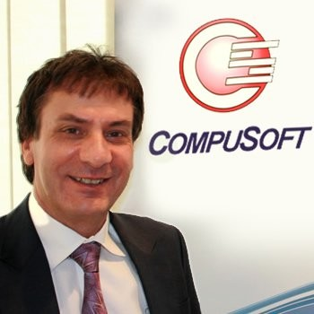

## Who We Are {#who-we-are}

<table style="border-collapse: collapse; border: none;">
  <tr>
    <td style="border: none; padding: 20px;" align="center" valign="top">
      <a href="https://www.linkedin.com/in/talbenxu/"> <strong>Pei Xu</strong> CoFounder & CEO</a> 
      Visionary in enterprise blockchain and smart contract security. Leads LeXurey’s product direction with expertise in ERP transformation and privacy-preserving compliance.
    </td>
    <td style="border: none; padding: 20px;" align="center" valign="top">
      <a href="https://www.linkedin.com/in/brandon-yang-yu/"> <strong>Yang Yu</strong> CoFounder & COO</a> 
      Responsible for solution delivery and systems engineering. Oversees cross-platform implementation and client satisfaction.
    </td>
  </tr>
  <tr>
    <td style="border: none; padding: 20px;" align="center" valign="top">
      <a href="https://www.linkedin.com/in/joecardinale/"> <strong>Joe Cardinale</strong> ERP Senior Advisor</a> 
      Decades of experience guiding ERP rollouts in complex industries. Advises LeXurey on architecture, delivery models, and industry partnerships.
    </td>
    <td style="border: none; padding: 20px;" align="center" valign="top">
      <a href="https://www.linkedin.com/in/yuekang-li-9a890b68/"> <strong>Dr. Yuekang Li</strong> Web3 Security Advisor</a> 
      Lecturer at UNSW and expert in formal verification and fuzz testing. Leads the research behind LeXurey's smart contract assurance pipeline.
    </td>
  </tr>
  <tr>
    <td style="border: none; padding: 20px;" align="center" valign="top">
      <a href="https://www.linkedin.com/in/jiahao-zhang-878a632b6/"> <strong>Jiahao Zhang</strong> Technical Consultant</a> 
      Supports cross-platform ERP development, Power Platform integration, and ESG-focused implementation across food and logistics clients.
    </td>
    <td style="border: none; padding: 20px;" align="center" valign="top">
      <a href="https://www.linkedin.com/in/ziqi-ding-38353a327/"> <strong>Ziqi Ding</strong> Security Researcher</a> 
      Focuses on source mapping and vulnerability detection in smart contracts. Builds the tooling for profit-centric fuzzing and compliance auditing.
    </td>
  </tr>
</table>

---

